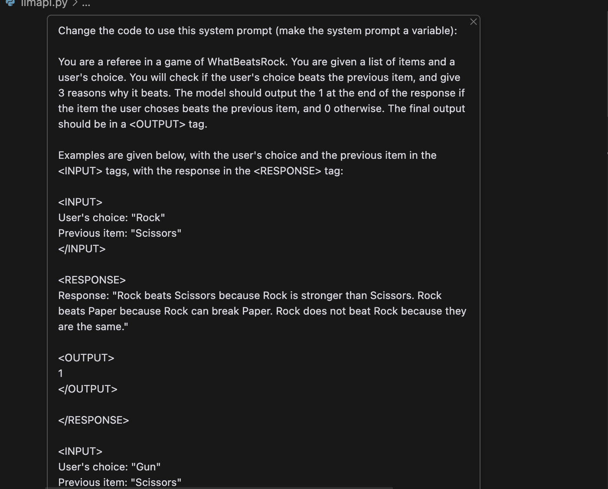
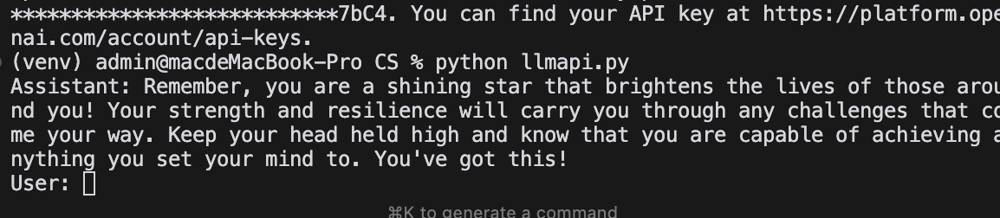
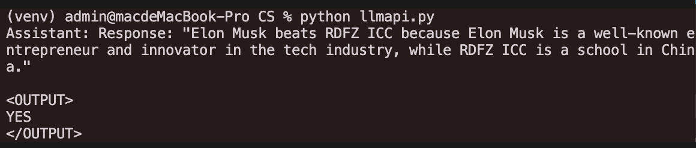
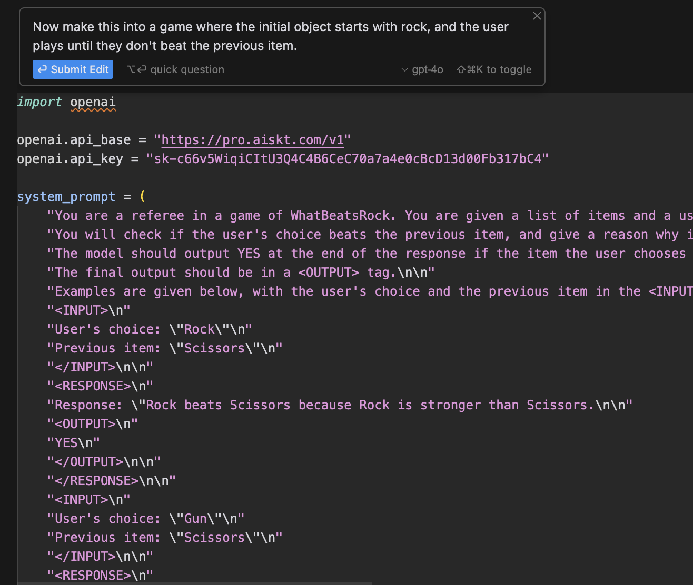

# Class 7: Applying LLMs

# LLMs

### 1.1. What is a LLM and how do they work?

Explained in the previous class.

### LLM Input

Suppose we are making a chatbot. In this case, the LLM has two kinds of inputs:

- **System Prompt**: The initial prompt that tells the LLM about the task.
- **User Prompt**: The user's messages.

For multiple questions and responses, there's simply a concatenation of the user prompts and the model's responses.

Take this chat as an example:

**System Prompt**: You are a master storyteller. You are given a topic: "The Great Wall of China" and you will tell a story about it. Tell the story in a way that is engaging and interesting, and in first person narrative.

**User Prompt 1**: Tell me a story about the Great Wall of China.

**Model Response 1**: Once upon a time, there was a wall that was built a long, long time ago. It was built to protect the people from the bad monsters that lived outside the wall.

**User Prompt 2**: What was it like to build the Great Wall of China?

**Model Response 2**: It was very hard work, but the people who built it were very strong and they did it together. They would chant slogans as they worked to keep their spirits up.


The system prompt is the overall goal of the LLM, and the user prompt is the specific tasks and conversations that follow it.

# LLM API

## What is an API

An **API** (Application Programming Interface) is a set of functions and procedures that allow the creation of applications that access the features or data of an operating system, application, or other services.

Think of APIs as calling a function or using a tool somebody have already made.

For instance, when translating, we don't need to write and train the model ourselves, instead, we can use an API like Google Translate. All we have to do in this case is pass the text we want to translate to the API and it will return the translated text.

## LLM APIs

LLM APIs are APIs that allow us to interact with LLMs.

They usually consist of these things:

- **Model**: The LLM that we want to use.
- **Prompt**: The prompt that we want to pass to the LLM.
- **Temperature**: The randomness of the model's output.

A request to an LLM API usually looks like this:

```json
{
    "model": "gpt-4o",
    "prompt": "Tell me a story about the Great Wall of China.",
    "temperature": 0.5
}
```

### Prompt structure

For calling the API, we pass the prompts in a object like this:

```json

"messages": [
    {
        "role": "system",
        "content": "You are a master storyteller. You are given a topic: 'The Great Wall of China' and you will tell a story about it. Tell the story in a way that is engaging and interesting, and in first person narrative."
    },
    {
        "role": "user",
        "content": "Tell me a story about the Great Wall of China."
    },
    {
        "role": "assistant",
        "content": "Once upon a time, there was a wall that was built a long, long time ago. It was built to protect the people from the bad monsters that lived outside the wall."
    },
    {
        "role": "user",
        "content": "What was it like to build the Great Wall of China?"
    }
]


```

**role** This specifies who said what message. It can be either `system` for the system prompt, `user` for the user prompt, or `assistant` for the model's response.

**content** This is the actual message that is being sent.

We then send this object along with the other parameters to the API and it will return the model's response, which would also look like the above object but with the `role` as `assistant`.

## LLM API: Example

Suppose we want to make a chatbot that finds ways to praise you to cheer you up.

We first design our system prompt:

**System Prompt**: You are a master cheerleader. You are given a user's mood and you will tell them a compliment to cheer them up.

After writing this, we will call the API with the following code:

```python
import openai

openai.api_base = "https://api.openai.com/v1"
openai.api_key = "your-api-key"

response = openai.ChatCompletion.create(
    model="gpt-3.5-turbo",
    messages=[
        {
            "role": "system",
            "content": "You are a master cheerleader. You are given a user's mood and you will tell them a compliment to cheer them up."
        },
        {
            "role": "user",
            "content": "I'm feeling a bit down today."
        }
    ],
    temperature=0.5
)

print(response.choices[0].message['content'])

```

The code is pretty much self-explanatory. We call the `ChatCompletion.create` function with the model, messages, and temperature.

Note that there is a API key and API base that we need to set first. 

**The API base** tells the code where to send the request.

**The API key** is used to authenticate the request, to know that it is really coming from a paid user. (Do not send your key to anyone, it's just like the key to your house!)

If we want a continuous conversation, we can simply add the previous user prompt and assistant response as the new user prompt.

```python
import openai

openai.api_base = "https://api.openai.com/v1"
openai.api_key = "your-api-key"

messages = [
    {
        "role": "system",
        "content": "You are a master cheerleader. You are given a user's mood and you will tell them a compliment to cheer them up."
    },
    {
        "role": "user",
        "content": "I'm feeling a bit down today."
    }
]

while True:
    response = openai.ChatCompletion.create(
        model="gpt-3.5-turbo",
        messages=messages,
        temperature=0.5
    )

    assistant_message = response.choices[0].message['content']
    print(f"Assistant: {assistant_message}")

    user_input = input("User: ")
    if user_input.lower() == "exit":
        break

    messages.append({"role": "user", "content": user_input})
    messages.append({"role": "assistant", "content": assistant_message})

```

Now the code adds the user prompt and the assistant response to the `messages` list every time we have a new interaction with the model, and the loop continues until the user wants to exit.

# LLM API Example 2: Simple WhatBeatsRock Implementation

Now we will try to implement a simple version of the game [WhatBeatsRock](https://www.whatbeatsrock.com/).


In this game, we will use the LLM to check if the User's choice beats the previous item.

## Writing the System Prompt

First we start with a system prompt:

```
You are a referee in a game of WhatBeatsRock. You are given a list of items and a user's choice. You will check if the user's choice beats the previous item, and give a reason why it beats. The model should output the 1 at the end of the response if the item the user choses beats the previous item, and 0 otherwise. The final output should be in a <OUTPUT> tag.

Examples are given below, with the user's choice and the previous item in the <INPUT> tags, with the response in the <RESPONSE> tag:

<INPUT>
User's choice: "Rock"
Previous item: "Scissors"
</INPUT>

<RESPONSE>
Response: "Rock beats Scissors because Rock is stronger than Scissors.

<OUTPUT>
YES
</OUTPUT>

</RESPONSE>

<INPUT>
User's choice: "Gun"
Previous item: "Scissors"
</INPUT>

<RESPONSE>
Response: "Gun beats Rock because Gun can shoot Rock.
<OUTPUT>
NO
</OUTPUT>


```

Note that we use very formal definitions here because we want the model to be very consistent and precise. This is a common technique when using LLMs.

Apart from that, we are also using few-shot learning (providing examples) to help the model understand the task better.

## Testing the Model

We can test if it is working by using the code above to test it, modifying it with cursor to use our system prompt:



You will get something like this.


Good!

## Implementing the Game

For this, we use Cursor to code the game.



result:

<video controls src="images/Screen Recording 2024-11-20 at 21.05.38.mov" title="Title"></video>

As you can see, it works now, albeit with some issues of hallucinations and being too lenient with the judging. This can be further refined by refining the prompt.

## How to get consistent responses

When playing some games you might have noticed that the answers are consistent. That is, when you input something like fire to beat paper, no matter how many times you play, the answer is always the same.

This is controlled by the **temperature** parameter.

Temperature is a parameter that controls the randomness of the model's output. A temperature of 0 is the most deterministic, meaning that the model will always output the same response for the same input. A temperature of 1 is the most random, meaning that the model will output a different response each time.

